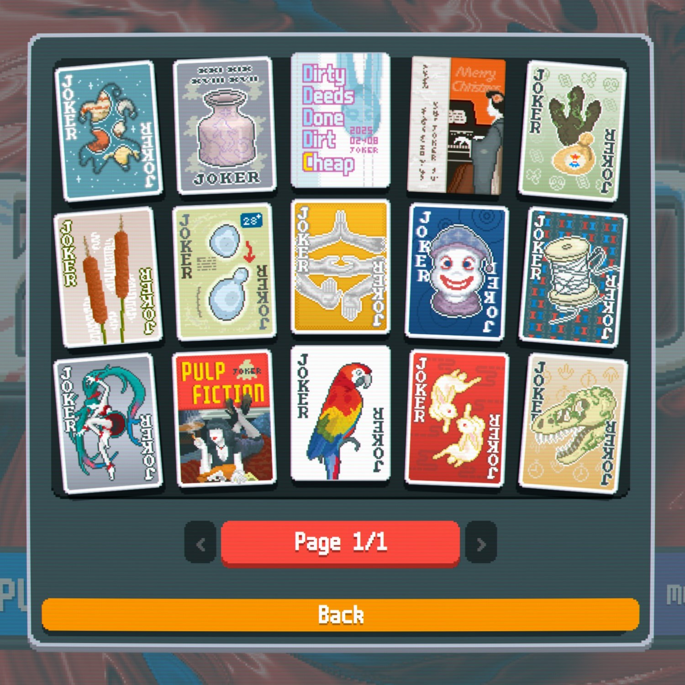

A __vanilla-like__ Balatro Mod that adds 15 new Jokers.  
Requires [Steamodded](https://github.com/Steamodded/smods) and [Lovely](https://github.com/ethangreen-dev/lovely-injector).  

Bugs? Feedback? Share them here on [Discord](https://discord.com/channels/1116389027176787968/1409110851608379422).

## ABOUT
Hey friends! I’m Brookling.  

Since the release of _Balatro_ in February 2024, I’ve been playing this game and absolutely love it.  
These days I mainly focus on Gold Stake win streaks, with a PB of 18.

From February to August 2025, I dedicated myself to creating a high-quality, vanilla-like mod,   
drawing a lot of inspiration from many existing mods (which I’ll recommend later) and feeling  
deeply grateful to their creators.  

I designed 15 new Jokers, each with unique abilities across a wide range of types, putting a lot of  
effort into balance, fun, and innovation — and illustrating all the cards myself.

Special thanks to Baimao for coding this project, and to all the friends who supported it.  
_Brook_ is now released and ready to play!

## CREDITS
### CONCEPT & ART  
 __Brookling__  
### CODING  
 __Baimao__ 
### THANKS TO  
__Snowlight, 280chan, Seastar and 22461__  

## RECOMMENDED MODS
__[Neato Jokers](https://github.com/neatoqueen/NeatoJokers)__  
__[Plantain](https://github.com/IcebergLettuce0/Plantain)__  
__[Extra Credit](https://github.com/GuilloryCraft/ExtraCredit)__  
__[KCVanilla](https://github.com/kcgidw/kcvanilla)__  
__[Partner](https://github.com/Icecanno/Partner-API)__
