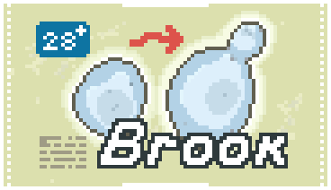

  

A vanilla-like Balatro Mod that adds 15 new Jokers  
Requires [Steamodded](https://github.com/Steamodded/smods) and [Lovely](https://github.com/ethangreen-dev/lovely-injector)  

## ABOUT
Hello! I'm Brookling.

I’ve been playing Balatro since its release in February 2024. I mainly focus on Gold stake win streaks,  
with a PB of 18 on the Blue Deck.

From February to August 2025, I worked on creating a high-quality vanilla-like mod.  I was inspired by  
many existing mods (which I’ll recommend later) and designed 15 new Jokers with diverse and unique  
abilities. I also spent a lot of time balancing and illustrating them.

Big thanks to Baimao for coding and to everyone who supported the project. Brook is now released—enjoy!

## CREDITS
### ART & CONCEPT  
###  Brookling  
### CODING  
###  Baimao  
### THANKS TO  
#### Snowlight, 280chan, Seastar and 22461  

## RECOMMENDED MODS
#### [Neato Jokers](https://github.com/neatoqueen/NeatoJokers)  
#### [Plantain](https://github.com/IcebergLettuce0/Plantain)  
#### [Extra Credit](https://github.com/GuilloryCraft/ExtraCredit)  
#### [Prism](https://github.com/blazingulag/Prism)
